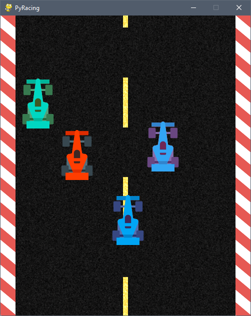

# PyRacing

Simple toy game made with pygame to explore game programming with my kids.

You are the red car and your aim of the game is to not get pushed to the bottom of the screen.

Score is based on how many cars left the bottom of the screen

### Controls

| Key    | Description            |
|--------|------------------------|
| Arrows | Move the car           |
| Space  | Pause / Start the game |
| Esc    | Close the game         |

### Running the game

I use `uv` (and so should everyone else!).

You can run this game with `uvx --from git+https://github.com/bayangan1991/Python-Car-Game pyracing`

## Contributing

After cloning the repository can install dependencies using `uv sync`

I don't know why you would, but you're more than welcome to open a pull request